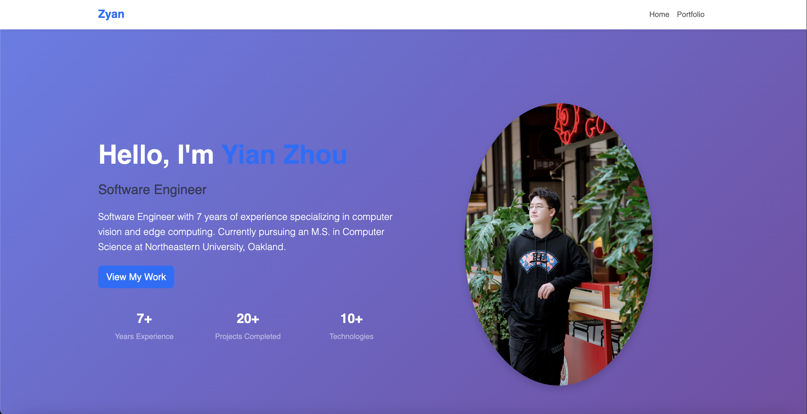

# Personal Homepage

## Author
Yian Zhou

## Class Link
[Class Link](https://northeastern.instructure.com/courses/225993)

## Screenshot
 

## Project Objective
This is a personal homepage built using vanilla HTML5, CSS3, and ES6+ JavaScript. 

## Features
- Responsive design using Bootstrap 5
- Smooth scrolling navigation
- Project showcase with GitHub links
- Professional hero section with statistics

## Tech Stack
- HTML5
- CSS3
- JavaScript ES6+
- Bootstrap 5
- No external libraries (vanilla JS only)

## GenAI Usage
I consulted Gemini 2.5 Flash for the following questions:
1. "Please provide some suitable font-family recommendations."
2. "Can you provide an example of a Bootstrap card hover effect and explain the parameters?"
3. "How can I use JavaScript to prevent a link from jumping and achieve a smooth scroll effect?"

These consultations helped me implement proper typography, interactive card effects, and smooth scrolling functionality in the homepage.